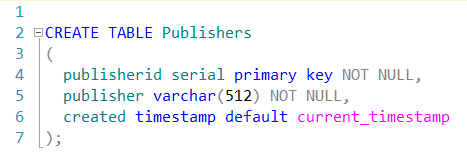
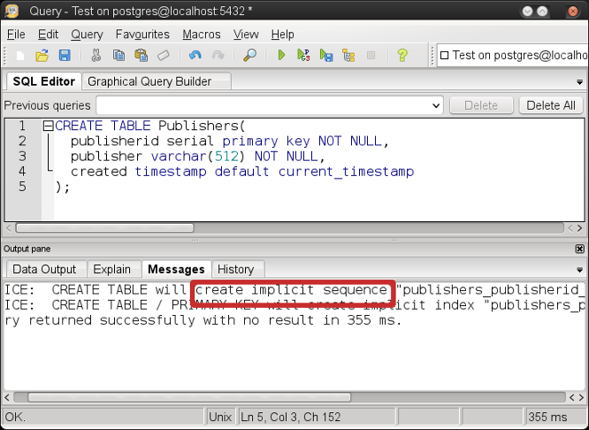
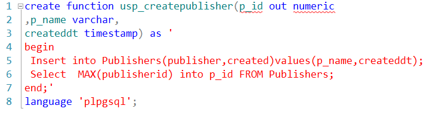
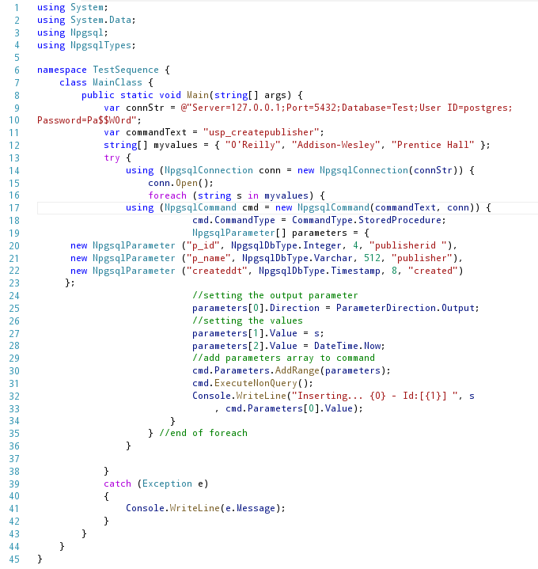
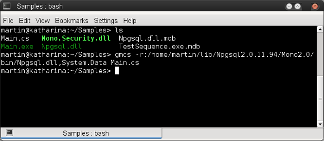
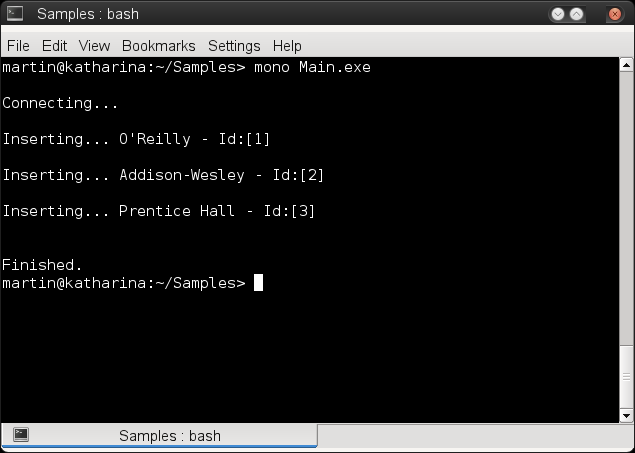
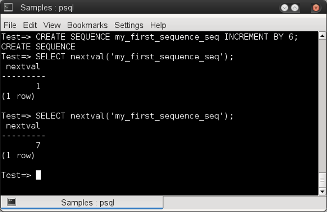
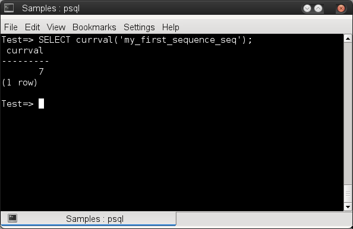
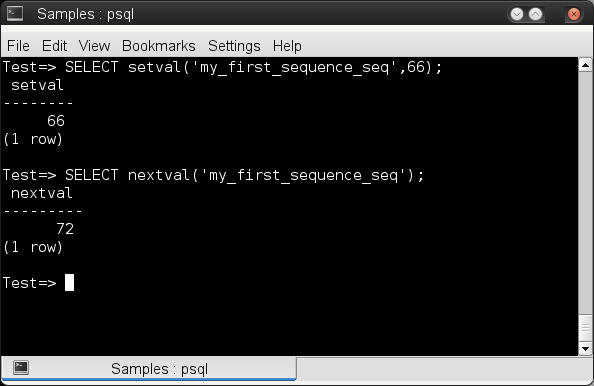
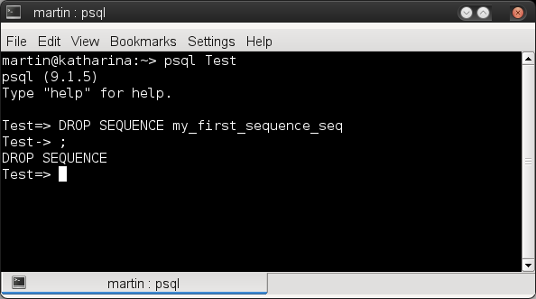

# Utilizando secuencias (sequences) en PostgreSQL con C#

Con frecuencia en un buen diseño de bases de datos es necesario que las tablas tengan al menos un identificador único para poderlas relacionar con otras, siguiendo las recomendaciones de las conocidas <a href="http://en.wikipedia.org/wiki/Codd%27s_12_rules">reglas de Codd</a> para el modelo relacional de bases de datos.Para cumplir con este requerimiento podemos fijarnos en la entidad que representa cada tabla y seguir la especificación del identificador único que le correspondería según nos dicten las reglas del negocio o el tipo de sistema que vamos a construir.

Hay casos en donde la tabla no tiene una entidad definida sino sirve únicamente como tabla de soporte para una relación muchos a muchos, como un catálogo o un listado de parámetros para el sistema, en estos casos donde no se tiene una especificación definida para asignar un identificador único lo más recomendado es utilizar una serie o un contador como valor para ese identificador.

<strong>PostgreSQL</strong> proporciona unos objetos llamados secuencias <strong>(sequences)</strong> que sirven para crear contadores o series, las secuencias son objetos de bases de datos al mismo nivel que las tablas, vistas, triggers o funciones.

Aunque pueden crearse contadores y series de forma manual esto no será tan eficiente como los objetos <em>sequence</em> que nos proporciona PostgreSQL ya que mejoran el desempeño de la base de datos sobretodo en sistemas multiusuario. La forma automática de crear una secuencia es utilizar el tipo de dato serial en una columna, como se muestra a continuación con el siguiente script para una tabla llamada  <em>Publishers</em>.

<!--Code-->

 
<!--Code-->

Al ejecutar este script se crean dos objetos: la secuencia <em>(sequence)</em> y la <em>tabla</em>  (en ese orden), como lo muestra la pestaña messages de <em>pgadmin</em> al finalizar la ejecución del script.

 

Ahora creamos una función plpgsql con la que agregaremos los registros a la tabla, en esta función establecemos los valores mediante parámetros para cada una de las columnas, excepto claro el identificador <em>(columna publisherid)</em>, ya que  de ese valor se encargará la secuencia.

<!--Code -->

 
<!--Code-->

Ahora con el siguiente programa en C# probaremos la secuencia agregando algunos registros e imprimiendo sus identificadores en la consola.

 

Compilamos el programa con el siguiente comando. 

<tt><b>$ gmcs -r:/home/martin/lib/Npgsql2.0.11.94/Mono2.0/bin/Npgsql.dll,System.Data Main.cs </tt></b>

 

Al ejecutar el programa, se mostrarán los registros agregados y los valores que les asigno la secuencia como identificador.

 

También podemos crear una secuencia (sequence) de forma manual siguiendo la sintaxis:

<pre>
<b>create sequence [name] start with [number] increment by [number]</b>
</pre>

De manera predeterminada las secuencias comienzan en el número 1 al menos no se indique con el comando <em>start with</em>.
Por ejemplo creamos una secuencia que se incremente de 6 en 6 

<pre>
<b>Test=# CREATE SEQUENCE my_first_sequence_seq INCREMENT BY 6;</b>
</pre>

Para acceder a los valores de la secuencia lo hacemos con un <strong>SELECT</strong> y la función <em>nextval()</em> como se muestra a continuación:

 

Observamos que la secuencia comienza en 1 e incrementa de 6 en 6. 
Para acceder al valor actual de la secuencia lo hacemos con la función <em>currval()</em> como se muestra a continuación:

 

Para establecer un nuevo valor en la secuencia utilizamos la función <em>setval()</em> 

 

Por último podemos eliminar la secuencia creada con el comando:

<pre><b>DROP SEQUENCE [name]</b></pre>

Como se muestra a continuación, en la siguiente imagen:

